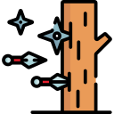
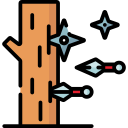

<table align="center" width="100%">
  <tr>
    <td align="center">
      
      <h3><strong>"I never go back on my word... That's my nindo (忍道), my ninja way!"</strong></h3>
      <h4><em>— Naruto Uzumaki —</em></h4>
    </td>
  </tr>
</table>
<!-- 
 -->
<!--    -->

 

<table align="center" width="100%" border="0" style="border: none; border-collapse: collapse;">
  <tr style="border: none; background-color: transparent;">
    <td width="21%" valign="middle" style="border: none;"></td>
    <td width="56%" valign="middle" style="border: none;"></td>
    <td width="21%" valign="middle" style="border: none;"></td>
  </tr>
</table>

<table align="center" width="100%" border="0" style="border: none; border-collapse: collapse;">
  <tr style="border: none; background-color: transparent;">
    <td width="40%" valign="middle" style="border: none;"></td>
    <td width="60%" valign="middle" style="border: none;"></td>
  </tr>
</table>

<!--

 

<h3>Languages</h3>

  

<h3>Frameworks &amp; Libraries</h3>

  

<h3>Tools &amp; Platforms</h3>

  

 -->

---

 

  
  

    
    
    
    
  

  

<!--  -->
